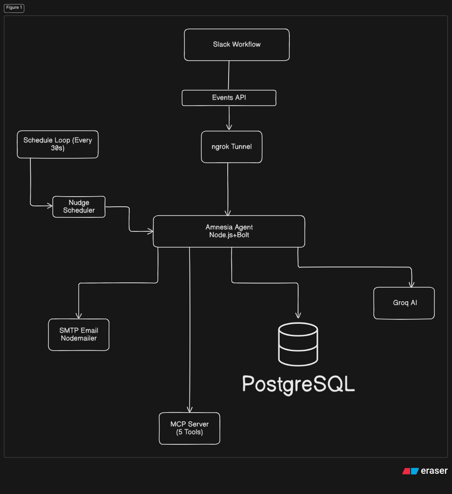
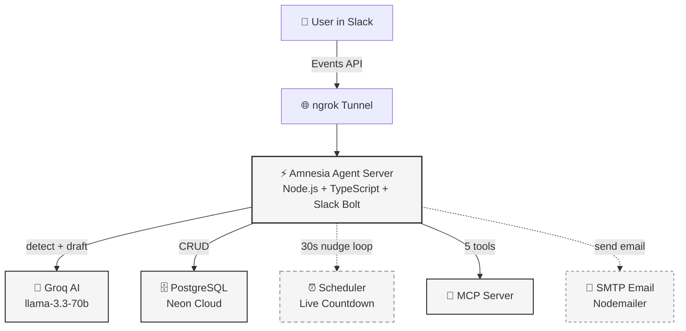

# Amnesia Agent

A Slack AI agent that catches forgotten commitments, tracks them with live countdowns, and follows through with AI-drafted completion emails.

## Architecture





## Features

- **AI Detection** — Groq extracts tasks & deadlines from natural language
- **Live Countdown** — Updates every 30s: ⏰ → ⚡ → 🔥 → 🔴
- **Interactive Cards** — Confirm, Edit, Dismiss, Complete, Reassign, Emergency
- **Conversation Linking** — "actually, make it 7 PM" auto-updates deadline
- **AI Email Draft** — Professional completion emails sent via SMTP
- **Dashboard** — `/commitments` slash command
- **MCP Integration** — 5 tools for AI agents to query commitments

## MCP Tools

| Tool | Description |
|------|-------------|
| `list_all_commitments` | All commitments across users |
| `list_active_commitments` | Only active ones |
| `search_messages` | Search DB + Slack history |
| `generate_boilerplate` | Code templates |
| `draft_completion_email` | AI-written completion email |

## Tech Stack

- **Runtime:** Node.js 20 + TypeScript
- **Framework:** Slack Bolt (HTTP Receiver)
- **AI:** Groq (llama-3.3-70b-versatile)
- **Database:** Neon PostgreSQL
- **Email:** Nodemailer (SMTP)
- **Tunnel:** ngrok (dev) / Render (prod)

## Quick Start

```bash
# Clone
git clone <repo>
cd SlackHackerthon

# Install
npm install

# Configure
cp .env.example .env
# Edit .env with your tokens

# Build
npm run build

# Run locally
npm run dev

# In another terminal
ngrok http 5000
```

## Environment Variables

| Variable | Required | Description |
|----------|----------|-------------|
| `SLACK_BOT_TOKEN` | ✅ | xoxb-... |
| `SLACK_APP_TOKEN` | ✅ | xapp-... |
| `SLACK_SIGNING_SECRET` | ✅ | |
| `GROQ_API_KEY` | ✅ | |
| `DATABASE_URL` | ✅ | Neon PostgreSQL |
| `SMTP_HOST` | ✅ | |
| `SMTP_PORT` | ✅ | |
| `SMTP_USER` | ✅ | |
| `SMTP_PASS` | ✅ | |
| `NOTIFICATION_EMAIL` | ✅ | From address |
| `PORT` | | Default: 5000 |

## Deploy (Render)

1. Push to GitHub
2. New Web Service on Render
3. Build: `npm install && npm run build`
4. Start: `npm start`
5. Add all env vars
6. Update Slack Request URL to `https://your-app.onrender.com/slack/events`


## Demo Video

[Watch 2-min demo](DEMO_URL_HERE)

## License

MIT